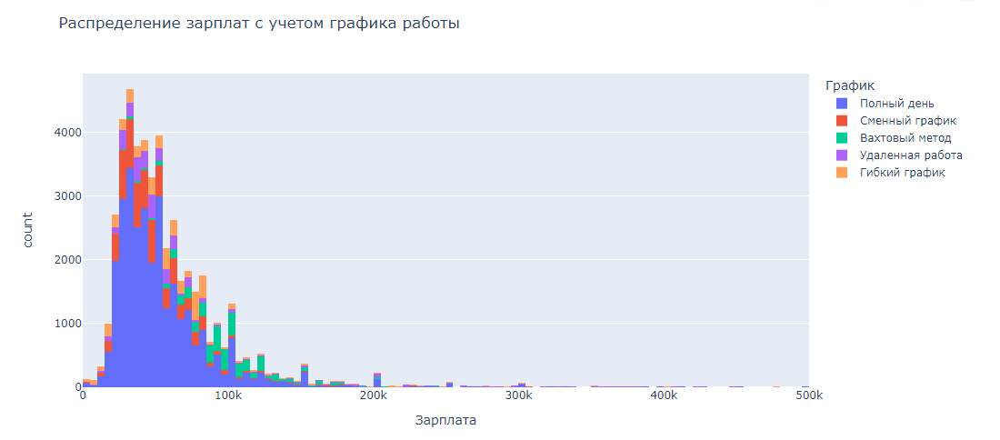
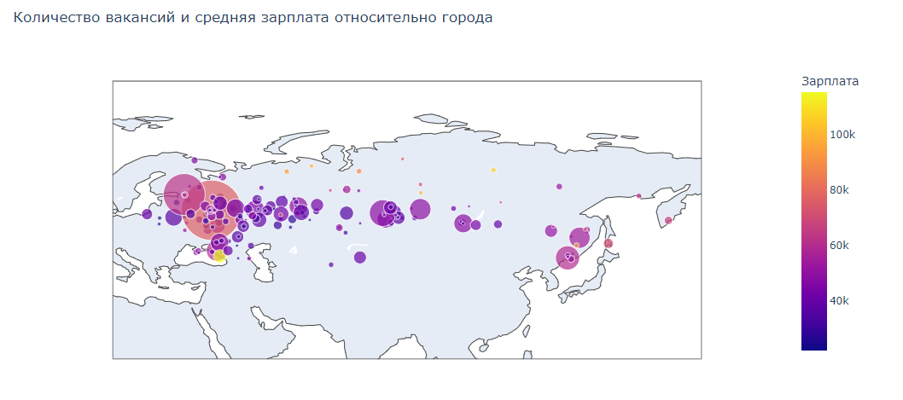

jobviz
==============================

Парсинг вакансий с hh.ru, анализ, визуализация, модели для прогноза зарплаты

------
Есть возможность скачивать словари данных и вакансии с апи hh.ru с использованием прокси, которые меняются при достижении лимита запросов; обучать заранее спроектированные модели, создавать новые модели; визуализировать статистические и географические распределения данных; представлять вакансию в виде вектора

# Использование
## Загрузка данных
файл src.data.load_vacancies:
```
usage: load_vacancies.py [-h] [--db DB] [--db-host DB_HOST] [--db-port DB_PORT] [--proxy-file PROXY_FILE]
                         [--proxy PROXY] [--verbose VERBOSE] [--date-from DATE_FROM] [--date-to DATE_TO]
                         [--workers WORKERS] [--new-console]

Загружает все вакансии за последний год

optional arguments:
  -h, --help            show this help message and exit
  --db DB               Имя бд (если не указано, берется из .env)
  --db-host DB_HOST     Хост подключения к mongodb (если не указано, берется из .env)
  --db-port DB_PORT     Порт подключения к mongodb (если не указано, берется из .env)
  --proxy-file PROXY_FILE
                        Файл со строками вида ip:port
  --proxy PROXY, -p PROXY
                        Прокси вида ip:port
  --verbose VERBOSE, -v VERBOSE
                        Управляет количеством сообщений
                        0 - нет сообщений, 1 - сообщение о каждой сохраненной вакансии,
                        n - сообщение о каждой n-ой сохраненной вакансии
  --date-from DATE_FROM
                        Дата, которая ограничивает снизу диапазон дат публикации вакансий
  --date-to DATE_TO     Дата, которая ограничивает сверху диапазон дат публикации вакансий
  --workers WORKERS, -w WORKERS
                        Количество потоков
  --new-console         Запускать скрипт для каждой прокси в отдельном терминале
```
файл src.data.load_dictionaries:
```
usage: load_dictionaries.py [-h] [--db DB] [--db-host DB_HOST] [--db-port DB_PORT] [--update] [--add-real-id]
                            [--create-key-skills]

Загружает и сохраняет все словари данных (https://api.hh.ru/dictionaries)

optional arguments:
  -h, --help           show this help message and exit
  --db DB              Имя бд (если не указано, берется из .env)
  --db-host DB_HOST    Хост подключения к mongodb (если не указано, берется из .env)
  --db-port DB_PORT    Порт подключения к mongodb (если не указано, берется из .env)
  --update             Не удалять коллекции если они существуют
  --add-real-id        Добавить id типа int
  --create-key-skills  Добавить все скилы
```
## Визуализация
**Отчеты в формате [html](reports/html/) (рекомендуется)**

Также доступны отчеты в формате [pdf](reports/pdf/) и [ipynb](notebooks) (не рекомендуется)

### Примеры графиков



### Обучение моделей
файл src.models.description_to_salary.train:
```
usage: train.py [-h] [--db DB] [--db-host DB_HOST] [--db-port DB_PORT] [--limit LIMIT] [--verbose VERBOSE] [--epochs EPOCHS]
                [--model MODEL] [--test-size TEST_SIZE] [--save] [--show-loss]

Обучает модель для предсказания зарплаты по описанию

optional arguments:
  -h, --help            show this help message and exit
  --db DB               Имя бд (если не указано, берется из .env)
  --db-host DB_HOST     Хост подключения к mongodb (если не указано, берется из .env)
  --db-port DB_PORT     Порт подключения к mongodb (если не указано, берется из .env)
  --limit LIMIT, -l LIMIT
                        Количество данных, загружаемых из базы (default: 10000)
  --verbose VERBOSE, -v VERBOSE
                        Уровень многословности (default: 1)
  --epochs EPOCHS, -e EPOCHS
                        Количество эпох
  --model MODEL, -m MODEL
                        Название модели (default: 'basic')
  --test-size TEST_SIZE
                        Размер тестовой выборки (default: 0.2)
  --save                Сохранить модель после обучение в папку models
  --show-loss           Открыть график изменения loss
```
